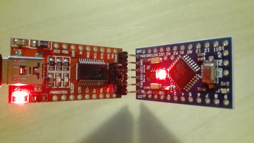
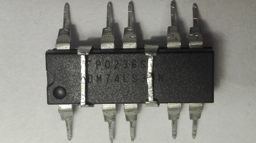
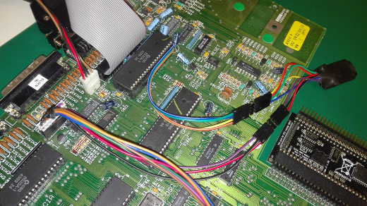

# Double-reset drive switch for the Amiga

An Arduino Pro Mini based Amiga proper drive switcher, that switches 
DF0/DF1 when a double-reset is detected.

## A more in depth rationale

The Amiga 500 (and other Amigas) generally boot from DF0: by default. 
DF0: being the internal floppy drive. The Gotek floppy emulator, 
paired with 3rd party firmware, has become a popular replacement 
or additional floppy solution. The Gotek won't fit nicely _inside_ 
the Amiga though, causing people to come up with a range of solutions.
Some include modifying the case of the Amiga 
(and that is... well... generally a bad thing...).

A cool solution is to build an adapter for the even CIA that switches 
the _SEL0 and _SEL1 signals, making the Amiga think that the (first) external 
drive is DF0. That way the Gotek can be connected externally, 
through an adapter, and the internal drive left as is.

However, this method comes with a few problems of its own. When the 
drives are switched, only the external drive usually will function.
This is because external drives are identified by _tracklist.device_ at 
boot using an Amiga-specific implementation that requires external drives
to have some additional hardware. The internal drive does not need to 
nor does it have this hardware (that is not entirely true, but 
true enough for this). However, when the drives are switched, the external 
drive no longer needs this hardware (but still has it) while the internal 
drive that needs it, doesn't have it. The external drive will function 
(as this hardware is ignored/unused), but not the internal drive.
That is perhaps not a major issue, but it still could be nice to boot
off the Gotek and still be able to write diskimages back to actual disks.

The second issue is that you might want to be able to select between having 
the internal or external drive as DF0:. That is usually done with a DPDT switch.
But then, you'd either need to drill a hole in the case 
(again, generally a bad thing), or snake the cables out through som e opening
in the case and leave the switch dangling outside (ugly, but perhaps less bad).

The idea behind this project is to fix both those issues, by implementing 
a switch that can be _inside_ the Amiga and listen to keyboard resets to 
do the  switching and and also to trick the Amiga to identify the 
internal drive as DF1:.

## Theory of operation / usage

A 74LS38 Quad NAND (with open collector output) is used to multiplex 
(switch between) _SEL0 and _SEL1. The Arduino is normally left in 
sleep mode, but it is awoken by an interrupt if the _KBRST goes 
low (the three finger salute).
It then waits for approximately two seconds, still monitoring the _KBRST 
line and if another reset is detected within this timeframe, it then toggles
the current state and restarts the wait. Once no resets are detected
the actual switched (or not, depending on the state) and back to sleep it is.
By timing the actual switch with some care, it can be done _after_ the 
external drive is identified, but _before_ the Amiga tries to boot off
the internal drive, leaving the internal drived identified (as the
external though, so the external needs to identify as a 3.5" DD drive)
and operational, while seamlessly booting from the external.

During cold-boot, the Arduino starts off as normal - awake. So, if you 
perform a *single* reset within 2 seconds, the drives are switched.
You could say that the cold-boot counts as the first reset.
If you later on do a reset, this will wake the arduino, and then *another*
reset within 2 seconds, will switch the drives.

## Preparation and materials

First off, you'd need a boot selector adapter for the even CIA. You buy 
one or build your own. There are very good guides available already on how 
to build them, such as 
[Boot selector guide](http://eab.abime.net/showthread.php?t=89581 "this one"), 
so I won't rehash that. Bottom line is that you need to separate 
*pin 13 - _SEL0* and *pin 14 - _SEL1* between the CIA and the socket on 
the mother board, so that in order to switch drives you can connect _SEL0 
from CIA to _SEL1 on the MB and vice-versa. 

You'd also need 5V, ground and the _KBRST line. They can be found at the
keyboard connector on the A500 motherboard. I prefer to build a patch to place 
between the keyboard connector and the pin header on the mother board, and
splice the lines from the patch. That way there are no modifications
done to any of the original hardware.
The pin spacing is normal 2.54mm. You can for example use a short 8 lead
female-female (Dupont wires) and insert pins from a pin header to do a 
gender change on one end. Or you could try use one of those female pinheaders
with extra long male pins (often referred to as stackable pin headers), 
frequently used for Arduino shields (the pins are usualy pretty flimsy though).

| Pin No | Signal | Note |
|--|--|---|
| 1 | _KBCLOCK | |
| 2 | _KBDATA | |
| 3 | _KBRESET | We need this line |
| 4 | Vcc (5v) | We need this line |
| 5 | KEY | |
| 6 | Ground | We need this line |
| 7 | STATUS | |
| 8 | INUSE | |

For the actual switch-a-roo part, you'd need:
* An Arduino Pro Mini + a USB-TTL serial adapter (only for initial code upload)
* A 74LS38N Quad NAND w/ open collector
* 2 NPN transistors (BC547 or 2N2222 for example)
* Soldering equipment, general tools, scrap wire et.c.
* Perhaps some heat shrink tubing or something to finish up the build

## Building

Here's some thousand words showing my final result:


Maybe start by uploading the sketch to the Pro Mini. It would be frustrating
to build the entire thing and then find out the board is bad.
If unfamiliar with the Arduino IDE, remember to select the correct serial
port and the correct board.
I found that the USB to TTL serial board I've got, can simply be inserted
into the matching holes on the Pro Mini and by placing gentle pressure on
them, the contact good enough to do the upload. This way, you won't need
to solder a connector in.



Then, flatten out the legs of the NAND chip, so they point straight out.
Bend over pin 2 and 13 so they meet/touch on top of the chip and solder 
them together. Then do the same with pin 5 and 10. 



Make a wire jumper between pin 3 and 6, as close to the chip as possible, 
being careful not to make contact with pin 4 (or 5+10), I left some 
insulation on the wire for that. Make a another wire jumper between 
pin 11 and 8 (watching out for pin 9 and 13+2).

Using a needle nose pliers (or similar), bend just the very tip of each 
of the remaining legs down. That should make it possible just barely fit 
the chip *on the back* of the Arduino Pro Mini. So flip the Pro Mini over 
and fit the chip, so that the pins line up as such:

| 74LS38 | Arduino |
|--------|---------|
| 1 | A2 |
| 2 | A1 |
| 3 | A0 |
| 4 | 13 |
| 5 | 12 |
| 6 | 11 |
| 7 | 10 |
| 8 | 9 |
| 9 | 8 |
| 10 | 7 |
| 11 | 6 |
| 12 | 5 |
| 13 | 4 |
| 14 | 3 |

Once there is a good fit, you can tack the chip in place by soldering in 
pin 1 and 8 of the NAND (in opposite corners). You can then go on and solder 
pin 3, 4, 9 and 15 in place. But do *NOT* solder pin 6,7 and 11,12!

Now, the two NPN transistors (I used BC547, because that's what I had around) 
needs be fitted. Bend the collector of the first transistor, because it 
needs to 'skip over' a hole, and then fit it on the Arduino so that the 
collector is in the hole for pin 4 *on the Arduino* (that would correspond 
to pin 13 on the NAND, but of course that is pin is already bent over its back).
Pre-tin a piece of signal wire of appropriate length, and jam it in together 
with the collector (actually, it might be easier to insert the wire first and 
then push the collector in). This wire should then go to _SEL1 on the Amiga 
motherboard. The base and emitter should go in hole 11 and 10 on the Arduino 
*together with* pin 6 and 7 respectively from the NAND. Solder it up, cut off 
excess leads.

The next transistor should have collector + wire (that goes to _SEL0 on MB) 
in hole 12 of the Arduino. Base + pin 6 of the NAND in hole 11 and 
emitter + pin 7 in hole 10. Solder it up.

Now we are only missing a few wires.
To pin 2+13 tack on a wire that goes to _SEL0 (CIA) and to pin 5+10 one 
that goes to _SEL1 (CIA). Solder in a wire to 5V connection on Arduino 
(to KB Vcc), GND (to KB GND) and 2 (to _KBRES).

This is sort of an ASCII schematic of the connections
```
            +----------------------+
            |   Arduino Pro-Mini   |
            |    (flipped over)    |
            |                      |
            |                      |
Vcc(KB) <----x                    x----> GND (KB)
            |     +----------+    x----> _KBRST
            |x----|o 74LS38  |----x|
 SEL0 <--+  |     |-----x----|    x----x---> _SEL1 (MB) 
 (MB)    |  |x---x|   SEL0   |----x|   +---|x\
         |  |x---||   (CIA)  |x---x--------|x |
    |x\--x---x   ||-----x----||   x--------|x/
    |x |-----x---x|   SEL1   ||---x|       NPN
    |x/------x----|   (CIA)  |x---x|
    NPN     |     +----------+     |
            +----------------------+

```

And this is what it looks like all soldered up.


Finish the final build with heat shrink tubing around the entire thing,
so it doesn't short anything out inside the Amiga.




## A bit more on the timing

I've measured the timing of the signals on my Amiga 500 and found that
there is a window of about 1200ms between drive identification on
DF1: and the first boot attempt from DF0:. That is *plenty* of time to do
the switch.
But I have also found that the time from when reset goes high 
(active low, so that means leaving reset), until drive ID of DF0:
is about 1300ms on warm reset, but about 2100ms on cold-boot.

So, the switch needs to happen later than 2100ms after reset to account
for cold-boot. But before around 2500ms to not miss first boot.

I don't know anything about the timing on other Amigas, so I thought
I'd try to make the solution a bit more robust. So, I made the
initial timout 2400ms. If within this timeframe activity is detected
on _SEL1 (indicating drive ID sequence), the timeout is changed to 400ms.

The reasoning for this is that I hope 2400ms would be enough for most
cases (that is I hope there aren't any Amigas or conditions under which,
there would be a longer time between reset rising-edge and drive ID). 

On the other hand, the drives *could* then be switched pretty much as soon as
drive ID process is done, but that leaves little time for the user 
to sneak in the second reset, if the delay between reset->high and drive ID 
should be small. 

If you do have issues with the Amiga trying to boot off the internal drive
before switching, it is probably safe to lower the *DRIVEID_TIMEOUT_MS* 
(it should probably not be set to anything less than 2 though).

## Tricky tricks and hacky hacks explained

I'll explain a bit more in depth how this all works.

First off, this is a NAND multiplexer

```
                            _____
                       X __|     \     A
         _____           __|      )O---+     _____
      __|     \        S   |_____/     |____|     \
 S --|__|      )O---+       _____       ____|      )O--- Out
        |_____/  _S |______|     \     |    |_____/
                         __|      )O---+
                       Y   |_____/     B

```
X and Y are the input signals. S is the control signal (_S being the 
inverted value of S).
Writing out the truth table for the three inputs:

| S | X | Y | A | B | Out |
|---|---|---|---|---|-----|
| 0 | 0 | 0 | 1 | 1 |  0  |
| 0 | 0 | 1 | 1 | 0 |  1  |
| 0 | 1 | 0 | 1 | 1 |  0  |
| 0 | 1 | 1 | 1 | 0 |  1  |
| 1 | 0 | 0 | 1 | 1 |  0  |
| 1 | 0 | 1 | 1 | 1 |  0  |
| 1 | 1 | 0 | 0 | 1 |  1  |
| 1 | 1 | 1 | 0 | 1 |  1  |

Compare the output with the input and you see that *Out* is equal to
*X* when *S* is *1* and equal to *Y* when *S* is *0*.

So with the control signal S, we can choose which of the inputs X or Y
to be presented to the output.

We need two of these multiplexers, as we need one to mux _SEL0 and one
to mux _SEL1 (to the MB).

Here is also the first improvement, the S control signal comes from the
Arduino. We don't actually need the first NAND to invert the value of S,
that can be done in software.

```
          _____
 _SEL0 __|     \     A
       __|      )O---+     _____
     S   |_____/     |____|     \
          _____       ____|      )O--- _SEL0 -> MB
 _SEL1 __|     \     |    |_____/
       __|      )O---+
    _S   |_____/     B

          _____
 _SEL1 __|     \     C
       __|      )O---+     _____
     S   |_____/     |____|     \
          _____       ____|      )O--- _SEL1 -> MB
 _SEL0 __|     \     |    |_____/
       __|      )O---+
    _S   |_____/     D

```
So, this is what we need. When S=1 the output is non-inverted, i.e. _SEL0
to the motherboard is connected to _SEL0 from the CIA (and _SEL1 -> _SEL1).
When S=0, the output is inverted _SEL0 on the MB is connected to _SEL1 on
the CIA and vice-versa.

Wait! There is a problem. That is a total of six NAND gates and we only 
have four in the 74LS38.

The 74LS38 is *open collector output* and that is important. That means, 
that when it outputs a 1, the output is really disconnected and it is
expected that it is pulled high by an external pull-up resistor.

Contrary, when it outputs a 0, it really pulls the output low by connecting 
it to ground. That means we can wire-AND the two outputs together and save
the last NAND gate.
In other words, by directly connecting A and B above (and connecting the
expected pull-up), the output will be pulled low when _either_ of the
two NANDs pulls it low, the equivalent of a logical AND operation.
(This time to the truth table yourself, if you dont believe me).

The output still needs to be inverted though (NAND being AND + NOT, and 
we only have the AND part sorted right now). We fix that with an NPN
transistor that operates as an inverter.
Connect the collector through a pull-up to Vcc. Base to the wire-AND:ed
output of the two NAND gates, and emitter to ground.

```
                             ^
                             |
                             R
                         ^   2
          _____          |   |
     X __|     \     A   R   +----- Out
       __|      )O---+   1   | 
     S   |_____/     |   |   |
          _____      +---+--NPN
     Y __|     \     |       |
       __|      )O---+      GND
    !S   |_____/     B

```

When both the NAND gates output a 1, the transistor will turn on and
pull the collector (output) low. When either NAND ouputs a 0, the base 
will be held low, the transistor will cut and output pulled high by the
pullup (R2).

Cool, so we replaced the last NAND in the multiplexer by wire, a transistor
and two resistors. And by that we are down to a total of four NANDs.

We can pull some more tricks though. The resistors. By connecting the
base and collector to pins on the Arduino, we can choose to enable the
internal pull-ups for those pins. It is generally advisable to use proper
pull-ups, but the internal ones will do. This way we just need the additional
transistors and it is possible to solder this up without using a breadboard.

One last trick is used. Power and ground for the NAND chip... 
For ease of soldering, they are provided by digital pins. This also being
a generally bad idea, but the pins on the Arduino can sink/source 40mA if I
remember correctly. And that should be good enough for our needs.
 
